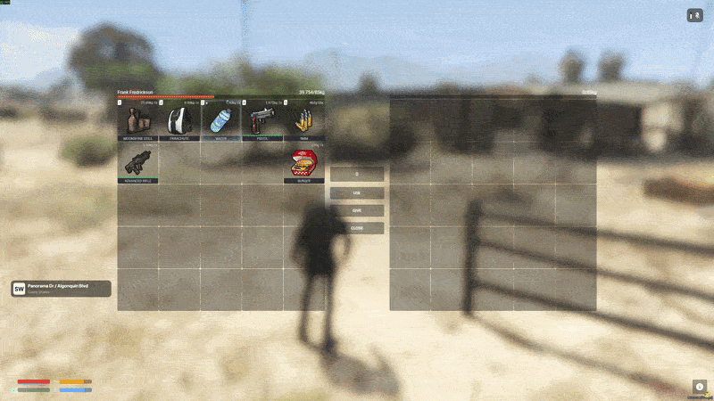
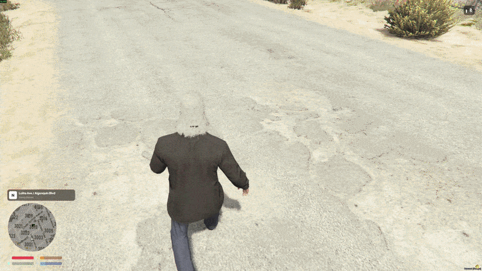
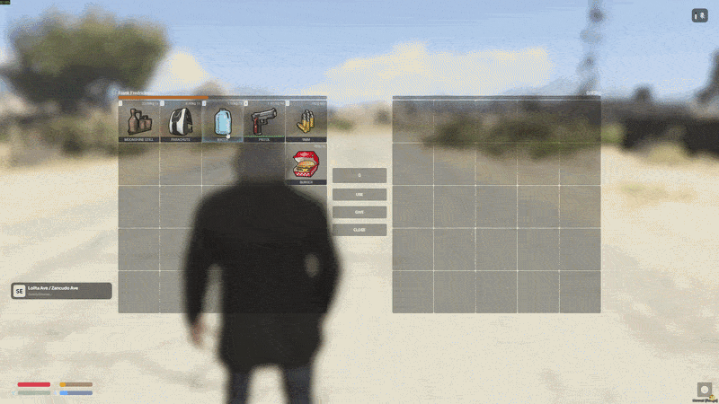

<div align="center">

# ox_inventory

A complete and modern inventory system for FiveM, providing a flexible slot-based inventory with support for shops, stashes, crafting, and vehicle storage.

[](https://github.com/MrNewb/ox_inventory/releases/latest/download/ox_inventory.zip)
[](https://github.com/MrNewb/ox_inventory/releases/latest/download/ox_inventory.zip)
[](https://github.com/MrNewb/ox_inventory/releases/latest/)\
[](https://5metrics.dev/resource/ox_inventory)
[](https://5metrics.dev/resource/ox_inventory)
[](https://5metrics.dev/resource/ox_inventory)

Refer to [CONTRIBUTING.md](./CONTRIBUTING.md) for contribution guidelines and to see our Contributor License Agreement.\
Refer to [NOTICE.md](./NOTICE.md) for additional information and legal notices.

</div>

## ℹ️ About this fork

This is **not** intended to replace the [Overextended](https://github.com/overextended/ox_inventory) release. It exists so **qb-core** users still have a maintained inventory with that compatibility restored — the creator of ox_inventory has declined to distribute an official build with qb-core support.

It works like stock ox_inventory. Hard dependencies are **[ox_lib](https://github.com/overextended/ox_lib)** and **[oxmysql](https://github.com/overextended/oxmysql)** — no external inventory bridges or middleman frameworks. You get the same core behaviour, with expanded framework compatibility and a few QoL features that are not in the main version.

> **Note:** Upstream syncs will continue as time allows. Do **not** report qb-core issues to the ox organization — report them [here](https://github.com/MrNewb/ox_inventory/issues).

### Fork additions

| Feature | Notes |
| --- | --- |
| **qb-core compatibility** | Restored functionality — same inventory, qb-core included again |
| **Item rarities** | Declined upstream; coloured stars + optional animated slot overlays via `rarity` |
| **Runtime items** | Standard on most inventories now — `RegisterItem` syncs clients and persists to `data/items.lua` |
| **Weapon customize** | Similar to qb-inventory — preview, rotate, attach/remove components and tints |
| **Per-item drop props** | `dropModel` / `dropmodel` for ground drops instead of the default bag |
| **Weapon throw** | Throw a weapon into the world as a take-only drop at the land point |

<details>
<summary><strong>Preview — Weapon customize</strong></summary>

<br>



Right-click a **weapon** in your inventory → **Customize**.

- 3D preview of the held weapon; drag to rotate
- Attach / remove components from inventory (clips, suppressors, scopes, grips, flashlights, etc.)
- **Skin** slot uses `at_skin_*` components from [`data/weapons.lua`](./data/weapons.lua)
- **Tint** slot uses consumable tint items with `server.tint` (tint index); not the same as skins

Components must already exist as items the player owns. Compatible attachments come from the weapon’s component list in `data/weapons.lua`.

</details>

<details>
<summary><strong>Preview — Drop props</strong></summary>

<br>



Set `dropModel` (or `dropmodel`) on an item so ground drops spawn that prop instead of the default bag.

```lua
['water'] = {
    label = 'Water',
    weight = 500,
    dropModel = `prop_ld_flow_bottle`, -- hash or model name string
}
```

Works for normal inventory drops. See more examples in [`data/items.lua`](./data/items.lua).

</details>

<details>
<summary><strong>Preview — Weapon throw</strong></summary>

<br>



Right-click a **weapon** in your inventory → **Throw**.

- Plays a throw anim, then removes the weapon from inventory
- Spawns a take-only drop at the land point (pickup only — not a free-for-all bag swap)
- Blocked while in a vehicle / dead (client); grenades and other `throwable` items are **not** thrown this way — they keep the normal throw/use path

Requires a real weapon item with a serial when present (identity is checked server-side).

</details>

<details>
<summary><strong>Usage examples</strong></summary>

<br>

**Rarity** — set on the item definition (copied into metadata when created):

```lua
['burger'] = {
    label = 'Burger',
    weight = 220,
    rarity = 'sparkle', -- star colour and/or animated overlay
}
```

Star colours: `common`, `uncommon`, `rare`, `epic`, `legendary`, `mythic`, `exotic`, `ancient`, `relic`, `divine`, `celestial`, `transcendent`, `ascended`, `artifact`, `unique`, `rainbow`.

Animated overlays (also valid `rarity` values): `sparkle`, `stinky`, `megarainbow`, `fire`, `frost`, `electric`, `toxic`, `shine`, `glow`, `cursed`, `newb` (aliases like `flame` / `ice` / `shock` work too).

**Drop prop** — see the collapsible preview above, or [`data/items.lua`](./data/items.lua).

**Runtime item** — from any server resource:

```lua
exports.ox_inventory:RegisterItem({
    name = 'my_item',
    label = 'My Item',
    weight = 100,
    stack = true,
    close = true,
})
```

**Weapon customize** — right-click weapon → **Customize**. Give the player component items (and optional tint items with `server.tint`) defined under Components / your items list.

**Weapon throw** — right-click weapon → **Throw**.

</details>

## 📚 Documentation

[overextended.dev/docs/ox_inventory](https://overextended.dev/docs/ox_inventory)

## 💾 Download

[Latest release (zip)](https://github.com/MrNewb/ox_inventory/releases/latest/download/ox_inventory.zip)

## 🧩 Supported frameworks

Hard dependencies: **[ox_lib](https://github.com/overextended/ox_lib)** and **[oxmysql](https://github.com/overextended/oxmysql)**. No other bridges. We do not guarantee compatibility or support for third-party resources.

- [ox_core](https://github.com/overextended/ox_core)
- [esx](https://github.com/esx-framework/esx_core)
- [qbox](https://github.com/Qbox-project/qbx_core)
- [qb-core](https://github.com/qbcore-framework/qb-core) — *restored in this fork*
- [nd_core](https://github.com/ND-Framework/ND_Core)

## ✨ Features

- Server-side security ensures interactions with items, shops, and stashes are all validated.
- Logging for important events, such as purchases, item movement, and item creation or removal.
- Supports player-owned vehicles, licenses, and group systems implemented by frameworks.
- Fully synchronised, allowing multiple players to [access the same inventory](https://user-images.githubusercontent.com/65407488/230926091-c0033732-d293-48c9-9d62-6f6ae0a8a488.mp4).

### Items

- Inventory items are stored per-slot, with customisable metadata to support item uniqueness.
- Overrides default weapon-system with weapons as items.
- Weapon attachments and ammo system, including special ammo types.
- Durability, allowing items to be depleted or removed overtime.
- Internal item system provides secure and easy handling for item use effects.
- Compatibility with 3rd party framework item registration.
- Metadata rarities (`rarity`) with coloured stars and optional animated overlays.
- Runtime items via [`exports.ox_inventory:RegisterItem`](#fork-additions).
- Per-item drop props via `dropModel` / `dropmodel` (hash or model name).

### Weapons

- Customize menu (similar to qb-inventory) — 3D preview, drag-to-rotate, attach/remove components and tints.
- Throw — anim + weapon prop drop at the land point (take-only; pickup only).

### Shops

- Restricted access based on groups and licenses.
- Support different currency for items (black money, poker chips, etc).

### Stashes

- Personal stashes, linking a stash with a specific identifier or creating per-player instances.
- Restricted access based on groups.
- Registration of new stashes from any resource.
- Containers allow access to stashes when using an item, like a paperbag or backpack.
- Access gloveboxes and trunks for any vehicle.
- Random item generation inside dumpsters and unowned vehicles.
